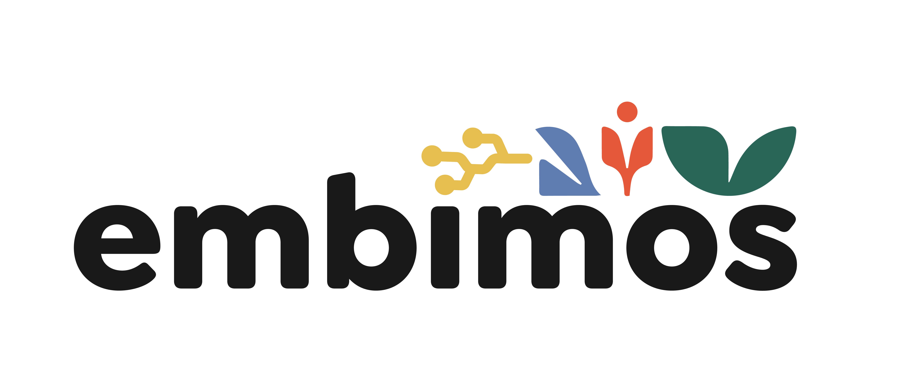

Library to extract information collected in the Minka API. This library is part of MECODA (ModulE for Citizen Observatory Data Analysis), aimed to facilitate analysis and viewing of citizen science data.




This repository is part of the work made by the EMBIMOS Reseach Group, at [Marine Sciences Institute](https://www.icm.csic.es/es/grupo-investigacion/environmental-and-sustainability-participatory-information-systems) (CSIC) of Barcelona.


# Installation

```bash
pip install mecoda-minka
```

# Use

## Get observations

With `get_obs` you can extract data from the observations collected in the API. The function supports combinations of these arguments, which act as filters, getting the observations in descending order of id, with a maximum of 20,000 (API limitation): 

| Argument | Descrition | Example |
| --------- | ----------- | ------- |
| `query` | Word or phrase found in the data of an observation | `query="quercus quercus"` |
| `project_name` | Name of a project | `project_name="urbamar"` |
| `id_project` | Identification number of a project | `id_project=806` |
| `id_obs` | Identification number of a specific observation | `id_obs=425` |
| `user` | Name of user who has uploaded the observations | `user="zolople"` |
| `taxon` | One of the main taxonomies | `taxon="fungi"` |
| `place_id` | Identification number of a place | `place_id=1011` |
| `place_name` | Name of a place | `place_name="Barcelona"` |
| `year` | Year of observations | `year=2019` |

For the `taxon` argument the possible values are: 
`chromista`, `protozoa`, `animalia`, `mollusca`, `arachnida`, `insecta`, `aves`, `mammalia`, `amphibia`, `reptilia`, `actinopterygii`, `fungi`, `plantae` y `unknown`.

Example of use:

```python
from mecoda_minka import get_obs

observations = get_obs(year=2018, taxon='fungi')

```
`observations` is an object list [`Observation`](#observation).


## Get projects

With `get_project` you can get the information of the projects collected in the API. The function supports a single argument, which can be the project identification number or the name of the project. In case the name does not correspond exclusively to a project, it returns the information from the list of projects that include that word. 

Example of use:

```python
from mecoda_minka import get_project

projects = get_project("urbamar")

```
`projects` es siempre una lista de objetos [`Project`](#project).


## Get count of observations by taxonomic family

With `get_count_by_taxon` we can know the number of observations that correspond to each of the taxonomic families. The function does not take any argument. 

Example of use:

```python
from mecoda_minka import get_count_by_taxon

count = get_count_by_taxon()

```
`count` is a dictionary with the structure {`taxonomy`: `number of observations`}

# Models

The models are defined using objects from [Pydantic] (https://pydantic-docs.helpmanual.io/). Type validation of all attributes is done and data can be extracted with the `dict` or` json` method. 

## Observation

The object `Observation` contains the information of each of the observations registered in [Minka] (https://minka-sdg.org/observations) and has the following attributes:

| Attribute | Type | Description | Default value |
| -------- | ---- | ----------- | ----------------- |
| `id` | `int` | Observation number |  |
| `captive` | `Optional[bool]` | State of captivity | `None` |
| `created_at` | `Optional[datetime]` | Creation date | `None` |
| `updated_at` | `Optional[datetime]` | Update date | `None` |
| `observed_on` | `Optional[date]` | Observation date | `None` |
| `description` | `Optional[str]` | Observation description | `None` |
| `iconic_taxon` | `Optional[IconicTaxon]` | Taxonomic family | `None` |
| `taxon_id` | `Optional[int]` | Identification number of the specific taxonomy | `None` |
| `taxon_name` | `Optional[str]` | Name of the species observed | `None` |
| `taxon_ancestry` | `Optional[str]` | String of the taxonomic sequence to which the observation corresponds, with identifiers separated by `/` | `None` |
| `latitude` | `Optional[float]` | Latitude | `None` |
| `longitude` | `Optional[float]` | Longitude | `None` |
| `place_name` | `Optional[str]` | Observation site name | `None` |
| `quality_grade` | `Optional[QualityGrade]` | Quality grade: `basico` o `investigacion` |`None` |
| `user_id` | `Optional[int]` | User identification number | `None` |
| `user_login` | `Optional[str]` | User registration name | `None` |
| `photos` | `List[Photo]` | Object lists [`Photo`](#photo), that include information about each photograph of the observation | `[]` |
| `num_identification_agreements` | `Optional[int]` | Number of votes in favor of identification | `None` |
| `num_identification_disagreements` | `Optional[int]` | Number of unfavorable votes to identification | `None` |


## Project

The `Project` object contains the information of each of the projects registered in [Minka] (https://minka-sdg.org/observations) and has the following attributes:

| Attribute | Type | Description | Default value |
| -------- | ---- | ----------- | ----------------- |
| `id` | `int` | Project identification number |  |
| `title` | `str` | Title of the project |  |
| `description` | `Optional[str]` | Project description | `None` |
| `created_at` | `Optional[datetime]` | Project creation date | `None` |
| `updated_at` | `Optional[datetime]` | Project update date |`None` |
| `latitude` | `Optional[float]` | Latitude |`None` |
| `longitude` | `Optional[float]` | Longitude |`None` |
| `place_id` | `Optional[int]` | Place identification number | `None` |
| `parent_id` | `Optional[int]` | Identification number of the project in which it is included |`None` |
| `children_id` | `List[int]` | Identification numbers of the projects it has inside | `[]` |
| `user_id` | `Optional[int]` | Identification number of the user who creates it | `None` |
| `icon_url` | `Optional[str]` | Link to project icon | `None` |
| `observed_taxa_count` | `Optional[int]` | Number of observations included in the project | `None` |


## Photo

The `Photo` object contains the information of each photography linked to an observation and has the following attributes.

| Attribute | Type | Description | Default value |
| -------- | ---- | ----------- | ----------------- |
| `id` | `int` | Photo identification number |   |
| `large_url` | `str` | Link to large format photo |   |
| `medium_url` | `str` | Link to the photograph in medium format |   |
| `small_url` | `str` | Link to the photo in small format |   |


# Contributions

To contribute to this library, follow the steps below.

* You need to have Python 3.7 or higher, virtualenv and git installed.

* Create a github fork of this project.

* Clone your fork and enter the directory

    ```bash
    git clone git@github.com:<your_username>/mecoda_minka.git
    cd mecoda_minka
    ```
* Configure your virtualenv to run the tests:
    ```bash
    virtualenv -p `which python3.7` env
    source env/bin/activate
    ```

* Install `mecoda_minka` and its dependencies.
    ```bash
    pip3 install -e .
    pip3 install -r requirements-dev.txt
    ```

* Create a new branch and make your changes:
    ```bash
    git checkout -b mi-nueva-rama
    ```

* Run the tests with:
    ```bash
    python -m pytest --cov-report term-missing --cov src tests
    ```

    If you need to pass a specific test, you can use `pytest -k <test-name>`.

* Update the documentation.

* Make commit, push and create your pull request.


## Upload a new version

* Switch to master and update:
    ```bash
    git checkout master
    git pull
    ```

* Create a new branch:
    ```bash
    git checkout -b <branch-name>
    git pull
    ```
* Make changes to the code

* Run the tests:
    ```bash
    python -m pytest --cov-report term-missing --cov src tests
    ```

* Edit the `setup.py` file to upload the version, which means changing the` version` argument in the `setup` function. The convention is 0.1.0 == major.minor.patch. `major` is to introduce changes that break the existing code. `minor` refers to changes that add functionality but do not break existing code. `patch` refers to changes that fix bugs but do not add functionality.

* Make commit and push:
    ```bash
    git add .
    git commit -m "<comment>"
    git push --set-upstream origin <branch-name>
    ```

* Follow the link to github returned by the push and merge.

* Update master:
    ```bash
    git checkout master
    git pull
    ```

* Create tag with the new version:
    ```bash
    git tag <new-version>
    git push --tags
    ```

* Build the package:
    ```bash
    rm dist/ build/ -r
    python setup.py -q bdist_wheel
    python setup.py -q sdist
    ```

* Upload package to pypi:
    ```bash
    twine upload -r pypi dist/*
    ```

Thanks for contributing to this project!